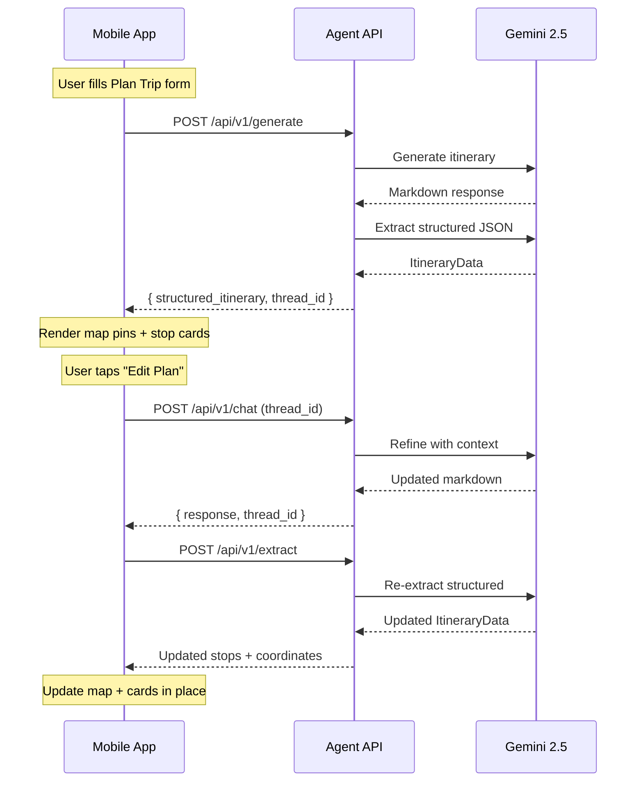

# PenangLens AI Agent — Architecture & API Documentation

## Overview

The PenangLens AI Agent is a LangGraph-powered travel assistant that creates personalized Penang itineraries. It uses Google Gemini 2.5 Flash for natural language understanding, tool-calling for data lookup, and structured output extraction for mobile-friendly JSON responses.

---

## Architecture

```
┌─────────────────────────────────────────────────────────┐
│                    FastAPI (app.py)                      │
│  ┌─────────┐  ┌──────────┐  ┌───────────┐  ┌────────┐  │
│  │  Chat   │  │ Generate │  │  Extract  │  │ Usage  │  │
│  │ /chat   │  │/generate │  │ /extract  │  │ /usage │  │
│  └────┬────┘  └────┬─────┘  └─────┬─────┘  └───┬────┘  │
│       │            │              │             │        │
│  ┌────▼────────────▼──────┐  ┌────▼─────┐  ┌───▼────┐  │
│  │     LangGraph Agent    │  │Extractor │  │ Token  │  │
│  │  (agent.py)            │  │          │  │Tracker │  │
│  │  ┌──────┐ ┌─────────┐  │  └──────────┘  └────────┘  │
│  │  │Guard-│ │Validator│  │                             │
│  │  │rails │ │         │  │                             │
│  │  └──┬───┘ └────┬────┘  │                             │
│  │     │          │       │                             │
│  │  ┌──▼──────────▼────┐  │                             │
│  │  │   Gemini 2.5     │  │                             │
│  │  │   Flash LLM      │  │                             │
│  │  └──────┬───────────┘  │                             │
│  │         │              │                             │
│  │  ┌──────▼───────────┐  │                             │
│  │  │  Tools           │  │                             │
│  │  │  • search_places │  │                             │
│  │  │  • get_landmark  │  │                             │
│  │  │  • get_travel    │  │                             │
│  │  │  • route_visual  │  │                             │
│  │  └──────────────────┘  │                             │
│  └────────────────────────┘                             │
│           50 Landmarks DB (landmarks.json)              │
└─────────────────────────────────────────────────────────┘
```

---

## File Reference

### Core Application

| File      | Purpose                                                               |
| --------- | --------------------------------------------------------------------- |
| `app.py`  | FastAPI server — all API endpoints, rate limiting, CORS, static files |
| `main.py` | CLI entry point for direct agent testing                              |

### Source Modules (`src/`)

| File                 | Purpose                                                                                                      |
| -------------------- | ------------------------------------------------------------------------------------------------------------ |
| `agent.py`           | LangGraph agent graph — guardrails → agent → tools → validation loop, `run_agent()` and `run_agent_stream()` |
| `models.py`          | All Pydantic models — request/response schemas, `ItineraryData`, `GenerateRequest`, `UserPreferences`        |
| `tools.py`           | Agent tools — `search_places`, `get_landmark_info`, `get_travel_time`, `create_route_visualization`          |
| `extractor.py`       | Structured output extraction — converts markdown responses to `ItineraryData` JSON via a second Gemini call  |
| `guardrails.py`      | Input validation — Penang-only scope check, content filtering, input sanitization                            |
| `validator.py`       | Response validation — checks itinerary structure, time constraints                                           |
| `route_optimizer.py` | Route optimization utilities and distance calculations                                                       |
| `token_tracker.py`   | Token usage tracking — per-request/session/global metrics with Gemini pricing                                |
| `logging_config.py`  | Structured logging setup + LangSmith integration                                                             |

### Frontend

| File                   | Purpose                                                                                             |
| ---------------------- | --------------------------------------------------------------------------------------------------- |
| `templates/index.html` | Dual-view UI — Plan Trip form + Chat view                                                           |
| `static/js/app.js`     | Frontend logic — form handling, SSE streaming, itinerary rendering, Leaflet maps, inline refinement |
| `static/css/style.css` | UI styling — glassmorphism, animations, responsive layout                                           |

### Data

| File                  | Purpose                                                                      |
| --------------------- | ---------------------------------------------------------------------------- |
| `data/landmarks.json` | Database of 50 Penang landmarks with coordinates, categories, pricing, hours |

---

## API Documentation

**Base URL**: `http://localhost:8000`  
**Content-Type**: `application/json`

### Rate Limits

- Chat endpoints: **20 requests/minute** per IP
- Generate endpoint: **5 requests/minute** per IP

---

### `POST /api/v1/generate`

**Primary endpoint for mobile app.** Generates a complete itinerary from form inputs and returns structured JSON with coordinates.

#### Request

```json
{
  "interests": ["Food", "Art", "History"],
  "start_time": "09:00",
  "end_time": "14:00",
  "start_location": "George Town, Penang",
  "travel_mode": "walking",
  "description": "I want to explore street art and try local food",
  "start_date": "2025-10-19",
  "end_date": "2025-10-19",
  "start_lat": 5.4164,
  "start_lng": 100.3327
}
```

| Field            | Type       | Required | Default                 | Description                        |
| ---------------- | ---------- | -------- | ----------------------- | ---------------------------------- |
| `interests`      | `string[]` | No       | `[]`                    | Interest tags from the form        |
| `start_time`     | `string`   | No       | `"09:00"`               | Start time (HH:MM)                 |
| `end_time`       | `string`   | No       | `"17:00"`               | End time (HH:MM)                   |
| `start_location` | `string`   | No       | `"George Town, Penang"` | Starting location name             |
| `travel_mode`    | `string`   | No       | `"walking"`             | `walking`, `driving`, or `transit` |
| `description`    | `string`   | No       | `""`                    | Free-text trip description         |
| `start_date`     | `string`   | No       | `null`                  | Date (YYYY-MM-DD)                  |
| `end_date`       | `string`   | No       | `null`                  | End date                           |
| `start_lat`      | `float`    | No       | `null`                  | GPS latitude                       |
| `start_lng`      | `float`    | No       | `null`                  | GPS longitude                      |

#### Response

```json
{
  "response": "## Your Penang Itinerary\n\n📍 Stop 1: Penang Street Art...",
  "thread_id": "abc123-def456",
  "structured_itinerary": {
    "stops": [
      {
        "order": 1,
        "name": "Penang Street Art",
        "short_description": "World-famous street murals by Ernest Zacharevic",
        "description": "Full description with historical context...",
        "lat": 5.4164,
        "lng": 100.338,
        "visit_duration_min": 45,
        "google_maps_url": "https://www.google.com/maps/place/...",
        "travel_to_next": {
          "distance_text": "1.1 km",
          "duration_text": "5 minutes",
          "duration_min": 5,
          "mode": "walking"
        },
        "tips": "Best visited in the morning for cooler weather..."
      }
    ],
    "total_duration_min": 180,
    "total_walking_distance": "2.5 km",
    "route_url": "https://www.google.com/maps/dir/...",
    "summary": "A 3-hour walking tour of Georgetown's heritage zone"
  },
  "token_usage": {
    "thread_id": "abc123",
    "total_requests": 2,
    "total_input_tokens": 3456,
    "total_output_tokens": 1234,
    "total_thinking_tokens": 0,
    "total_tokens": 4690,
    "total_cost_usd": 0.001258
  },
  "success": true
}
```

> **Usage**: Call this endpoint when the user submits the "Plan Trip" form. Use `structured_itinerary.stops` for map pins and cards. Save `thread_id` for refinement.

---

### `POST /api/v1/chat`

**Synchronous chat endpoint**. Used for refinement ("remove the cafe, add a museum"). Maintains conversation context via `thread_id`.

#### Request

```json
{
  "message": "Remove the cafe and add a museum instead",
  "thread_id": "abc123-def456",
  "user_preferences": {
    "interests": ["Art", "History"],
    "travel_mode": "walking"
  }
}
```

| Field              | Type     | Required | Description                           |
| ------------------ | -------- | -------- | ------------------------------------- |
| `message`          | `string` | **Yes**  | User message (max 2000 chars)         |
| `thread_id`        | `string` | No       | Session ID. Omit for new conversation |
| `user_preferences` | `object` | No       | See UserPreferences schema below      |

#### Response

```json
{
  "response": "I've updated your itinerary...",
  "thread_id": "abc123-def456",
  "intent": "modify_itinerary",
  "structured_itinerary": null,
  "token_usage": { ... },
  "success": true
}
```

---

### `POST /api/v1/chat/stream`

**SSE streaming endpoint**. Same input as `/api/v1/chat` but streams tokens in real-time.

#### Request

Same as `/api/v1/chat`.

#### SSE Events

```
event: start
data: {"type": "start", "content": "", "thread_id": "abc123"}

event: tool_start
data: {"type": "tool_start", "content": "Using search_places...", "tool_name": "search_places"}

event: tool_end
data: {"type": "tool_end", "content": "search_places completed", "tool_name": "search_places"}

event: token
data: {"type": "token", "content": "Here", "thread_id": "abc123"}

event: token
data: {"type": "token", "content": " is", "thread_id": "abc123"}

event: done
data: {"type": "done", "content": "", "thread_id": "abc123", "token_usage": {...}}
```

> **Usage**: Connect with `EventSource` or SSE client. Concatenate `token` events for the full response. The `done` event includes accumulated `token_usage`.

---

### `POST /api/v1/extract`

**Re-extract structured itinerary** from a text response. Used after chat-based refinement to update the itinerary UI.

#### Request

```json
{
  "response_text": "## Updated Itinerary\n\n📍 Stop 1: ...",
  "travel_mode": "walking"
}
```

#### Response

Returns `ItineraryData` JSON (same schema as `structured_itinerary` in the generate response).

> **Usage**: After calling `/api/v1/chat` for refinement, pass `response.response` into this endpoint to get updated structured data for map/card rendering.

---

### `GET /api/v1/usage`

**Token usage statistics** across all sessions since server start.

#### Response

```json
{
  "total_requests": 5,
  "total_sessions": 2,
  "total_input_tokens": 15234,
  "total_output_tokens": 8912,
  "total_thinking_tokens": 0,
  "total_tokens": 24146,
  "total_cost_usd": 0.007633,
  "uptime_seconds": 3600.0,
  "avg_tokens_per_request": 4829,
  "avg_cost_per_request_usd": 0.001527
}
```

---

### `GET /api/v1/usage/{thread_id}`

Token usage for a specific session.

---

### `GET /api/v1/sessions/{thread_id}`

Get conversation history for a session.

#### Response

```json
{
  "thread_id": "abc123",
  "messages": [
    { "role": "user", "content": "Plan a food tour..." },
    { "role": "assistant", "content": "Here is your itinerary..." }
  ],
  "message_count": 4
}
```

---

### `DELETE /api/v1/sessions/{thread_id}`

Delete a session and its conversation history.

---

### `GET /api/v1/health`

```json
{
  "status": "healthy",
  "version": "2.0.0",
  "gemini_configured": true,
  "maps_configured": true
}
```

---

## Mobile Integration Flow



### Recommended Mobile Flow

1. **Plan Trip** → `POST /api/v1/generate` → render `structured_itinerary`
2. **Show on Map** → use `stops[].lat`, `stops[].lng` for pins
3. **Stop Cards** → use `stops[].name`, `short_description`, `visit_duration_min`
4. **Expand Card** → show full `description`, `tips`, `google_maps_url`
5. **Travel Between** → show `travel_to_next.duration_text`, `distance_text`
6. **Refine** → `POST /api/v1/chat` with same `thread_id` → `POST /api/v1/extract` → update UI
7. **New Trip** → discard `thread_id`, show form again

---

## Environment Variables

| Variable              | Required | Description                     |
| --------------------- | -------- | ------------------------------- |
| `GOOGLE_API_KEY`      | **Yes**  | Gemini API key                  |
| `GOOGLE_MAPS_API_KEY` | **Yes**  | Google Maps API key (for tools) |
| `LANGCHAIN_API_KEY`   | No       | LangSmith tracing key           |
| `LOG_LEVEL`           | No       | Logging level (default: `INFO`) |

---

## Implemented Features

| #   | Feature                          | Status      |
| --- | -------------------------------- | ----------- |
| 1.1 | Session/Memory Management        | ✅          |
| 1.2 | SSE Streaming                    | ✅          |
| 1.3 | Structured Output (Pydantic)     | ✅          |
| 2.1 | Guardrails (Penang-only scope)   | ✅          |
| 2.2 | Validation Self-Correction Loop  | ✅          |
| 2.3 | User Preferences Integration     | ✅          |
| 3.1 | 50 Landmarks Database            | ✅          |
| 3.2 | Versioned API Design             | ✅          |
| 4.1 | Structured Logging + LangSmith   | ✅          |
| 4.2 | 71 Unit/Integration Tests        | ✅          |
| 5.1 | GenerateRequest + form-to-prompt | ✅          |
| 5.2 | Structured Itinerary Extraction  | ✅          |
| 5.3 | `/api/v1/generate` endpoint      | ✅          |
| 5.4 | HTML UI (dual-view)              | ✅          |
| 6.1 | Token Usage Tracking & Cost      | ✅          |
| 6.2 | Rate Limiting (slowapi)          | ✅          |
| 6.3 | Persistent Sessions (Postgres)   | 🔜 Deferred |

---

## Gemini 2.5 Flash Pricing

| Token Type | Price (per 1M) |
| ---------- | -------------- |
| Input      | $0.15          |
| Output     | $0.60          |
| Thinking   | $3.50          |

Typical cost per itinerary generation: ~$0.001–0.003 (2 LLM calls: agent + extraction)
