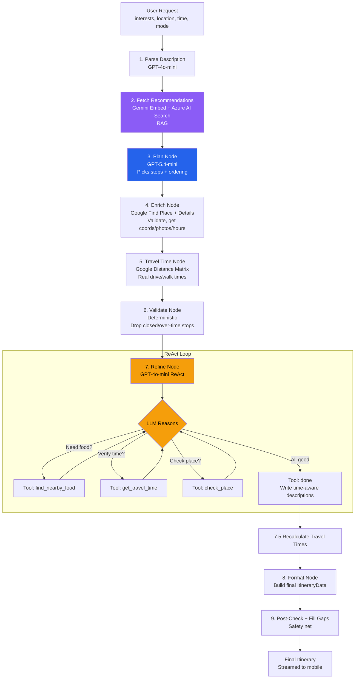
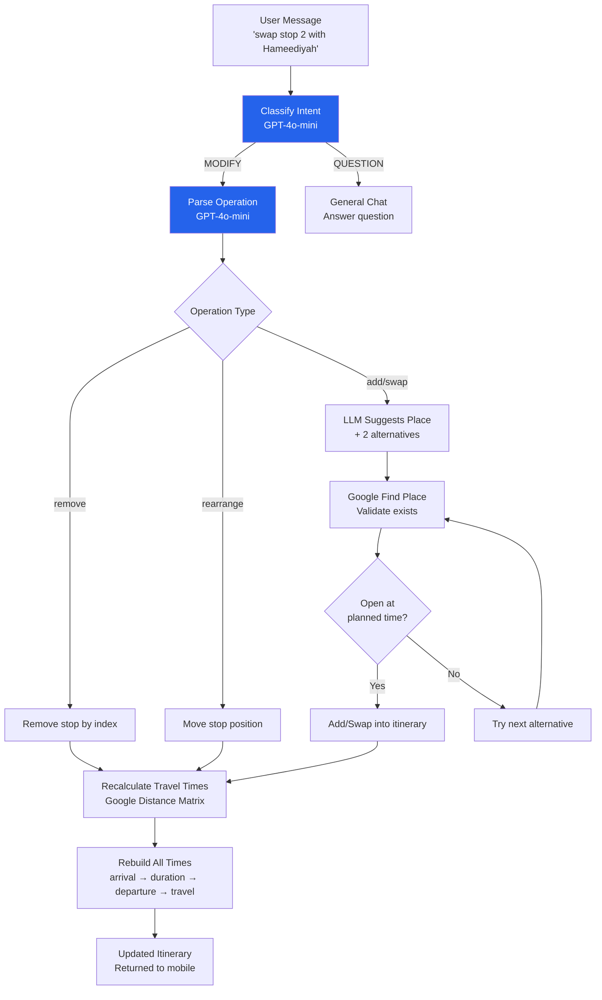
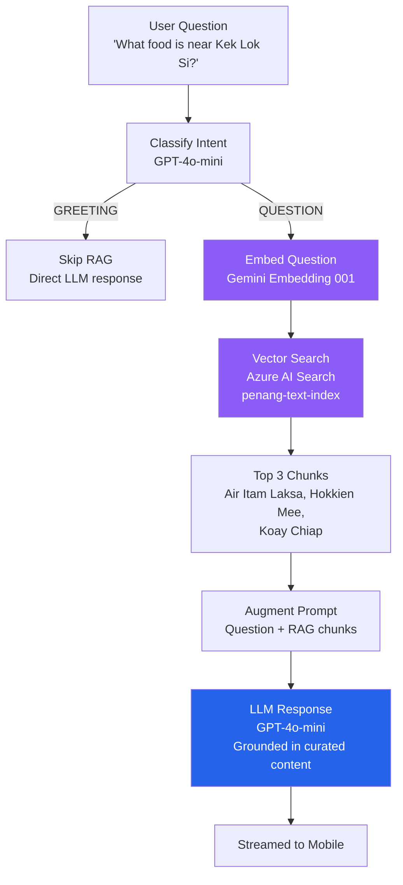
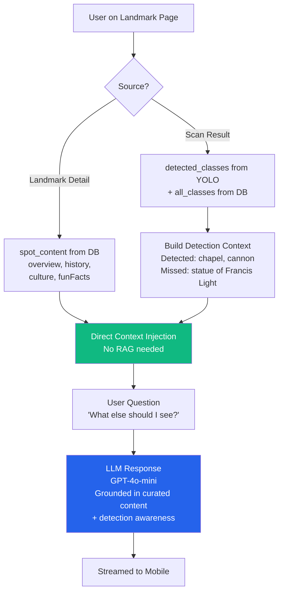
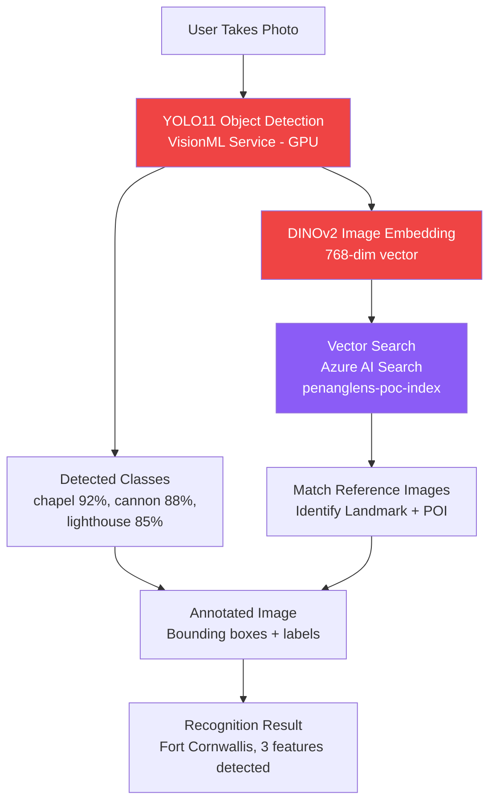
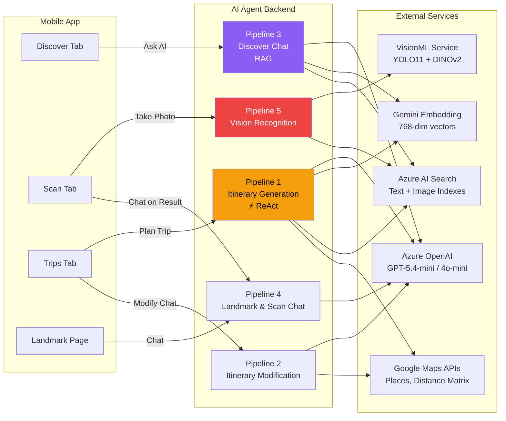

# PenangLens Pipeline Diagrams (Mermaid)

## Pipeline 1: Itinerary Generation (with ReAct)

## Pipeline 2: Itinerary Modification

## Pipeline 3: Discover Chat (RAG)

## Pipeline 4: Landmark & Scan Chat

## Pipeline 5: Vision Recognition

## System Overview — All 5 Pipelines

